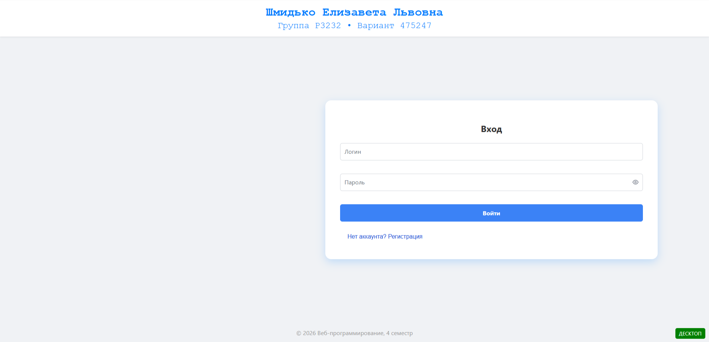
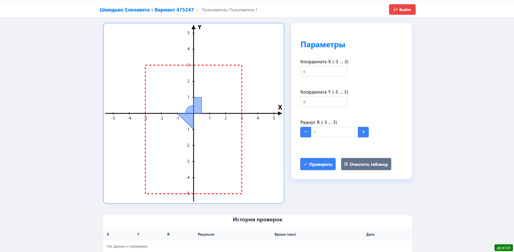
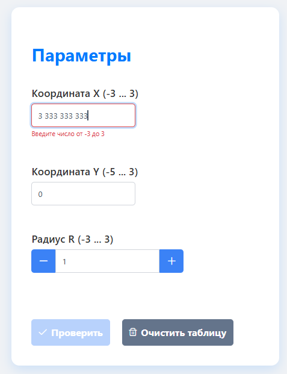
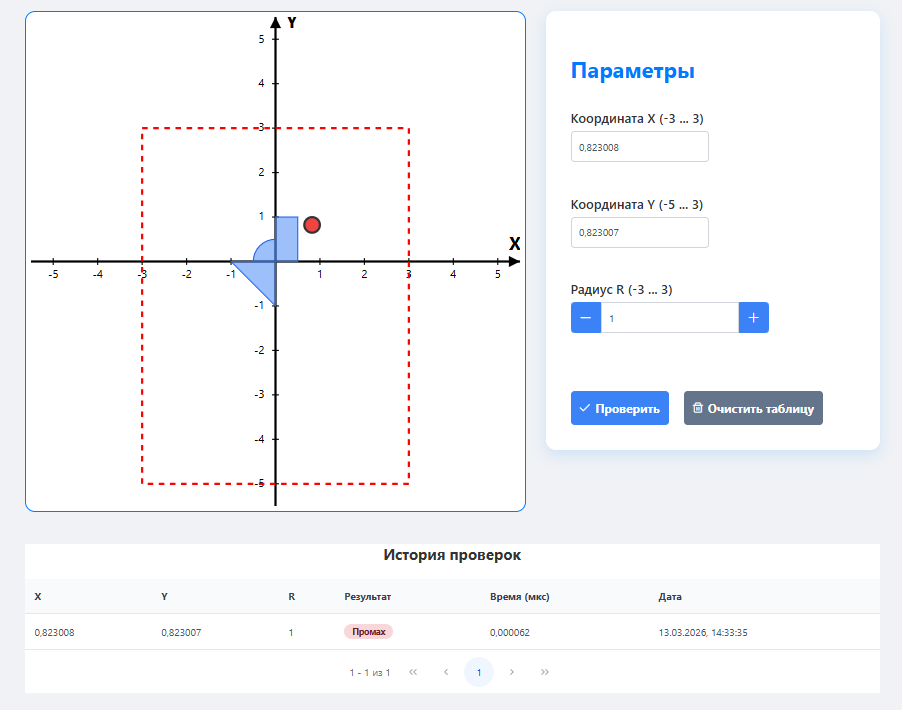
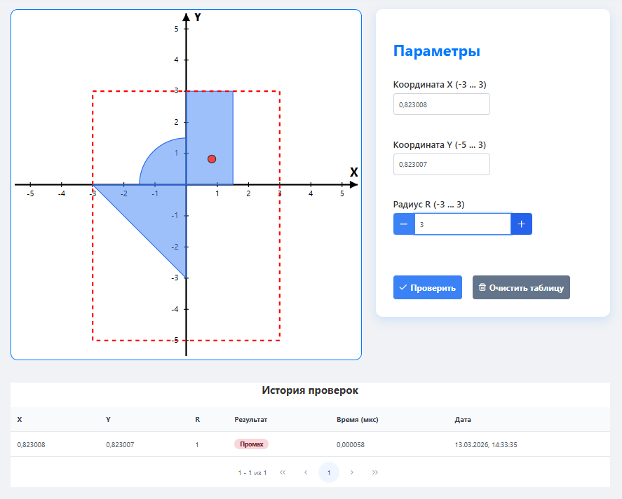
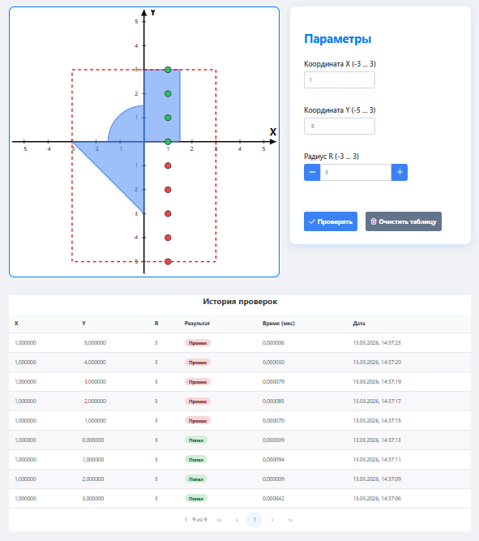
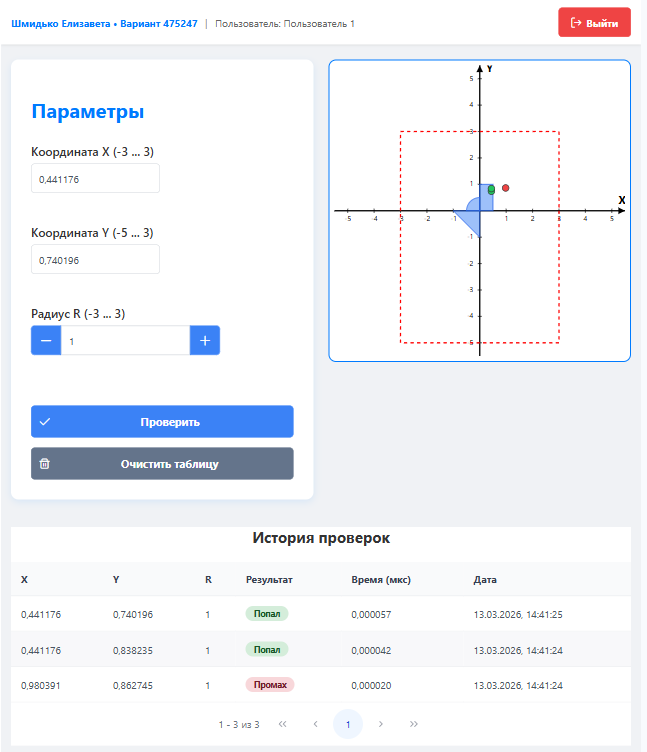
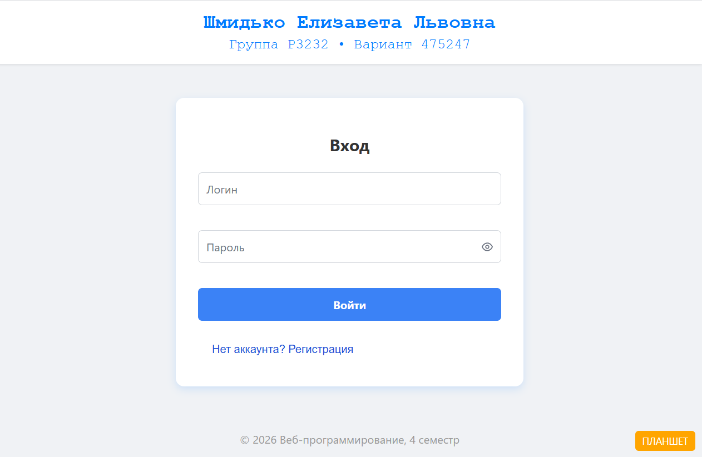
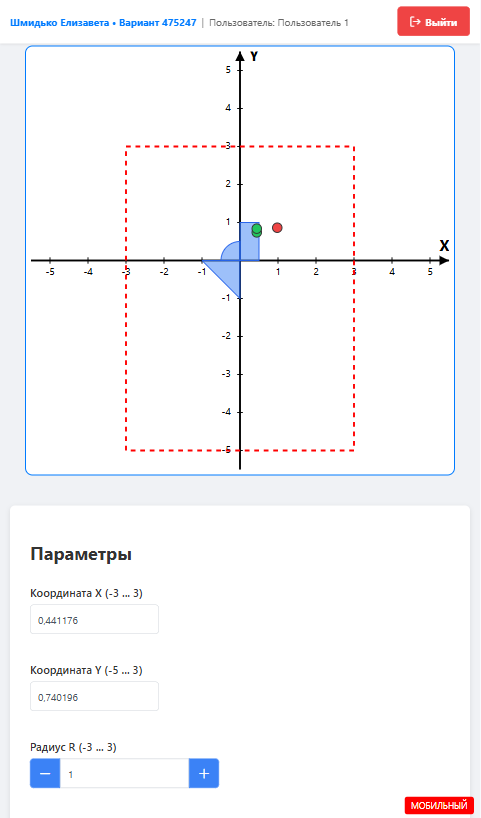
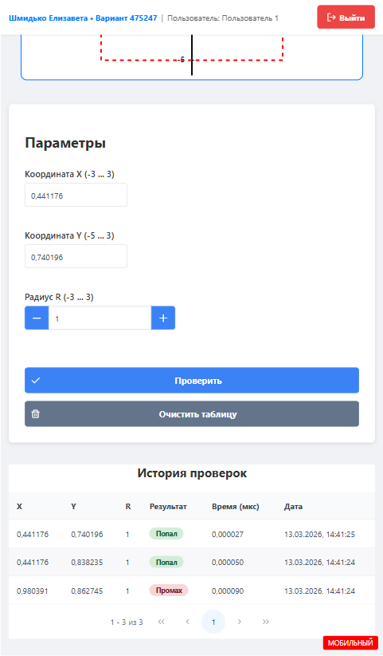

# Лабораторная работа №4  
### Java EE (EJB) + Angular (PrimeNG)  
## Описание проекта  
Веб-приложение для проверки попадания точки в заданную область на координатной плоскости.  
Реализовано на **Java EE** с использованием **EJB** (back-end) и **Angular** с библиотекой компонентов **PrimeNG** (front-end). Взаимодействие через **REST API**. Данные хранятся в **HSQLDB**, доступ через **JPA**.  

Приложение поддерживает **адаптивную вёрстку** для трёх типов устройств: десктоп (≥1122px), планшет (828px–1122px) и мобильные (<828px).  

## Функциональность  

### 1. Стартовая страница  
- Шапка с ФИО, группой и вариантом.  
- Форма входа (логин/пароль). Пароль хранится в БД в виде хэша.  
- Доступ к основной странице только для авторизованных пользователей.  

### 2. Основная страница  
- Поля ввода для координат **X** (текст, -3 … 3), **Y** (текст, -5 … 3) и радиуса **R** (текст, -3 … 3).  
- Динамическое изображение области на плоскости с уже нанесёнными точками.  
  - Клик по картинке отправляет координаты на сервер.  
  - Цвет точки зависит от попадания/непопадания.  
  - Смена радиуса перерисовывает область.  
- Таблица результатов предыдущих проверок (из БД).  
- Кнопка выхода (завершение сессии и возврат на стартовую страницу).  

### 3. Сохранение данных  
Все результаты проверок сохраняются в **HSQLDB** через **JPA**.  

---

## 📸 Скриншоты работы приложения  

### 🖥 Десктопная версия  

#### Стартовая страница  
  
*Форма входа с шапкой. Поля для логина и пароля.*  

#### Основная страница  
  
*Все элементы: поля X, Y, R; область с точками; таблица результатов; кнопка выхода.*  

#### Валидация ввода  
  
*Пример сообщения об ошибке при вводе некорректного значения (буквы, выход за диапазон).*  

#### Клик по области  
  
*Клик мышью по графику добавляет новую точку с координатами, соответствующими месту клика.*  

#### Смена радиуса  
  
*После изменения R область перерисовывается, точки на графике обновляются.*  

#### Таблица результатов  
  
*Список предыдущих проверок (X, Y, R, попадание, дата).*  

### 📱 Адаптивность  

#### Планшетная версия (ширина экрана 828–1122px)  
  
  
*Элементы перестраиваются для удобства на средних экранах.*  

#### Мобильная версия (<828px)  
  
  
  
*Элементы перестраиваются для удобства на малых экранах.*  

---

## 🛠 Технологии  

**Back-end:**  
- Java EE (EJB)  
- REST (JAX-RS)  
- JPA (Hibernate)  
- HSQLDB  

**Front-end:**  
- Angular 15+  
- PrimeNG  
- HTML5, CSS3 (адаптивная вёрстка)  

---

## ⚙️ Запуск приложения  

1. Клонируйте репозиторий.  
2. Настройте подключение к базе данных (HSQLDB) – параметры в `persistence.xml`.  
3. Разверните back-end на сервере приложений (например, Payara, WildFly).  
4. Установите зависимости front-end: `npm install`.  
5. Запустите Angular-приложение: `ng serve`.  
6. Откройте браузер по адресу `http://localhost:4200`.  

---

## 📌 Вопросы к защите  

*Список вопросов приведён в описании лабораторной работы.*  

---

## 📁 Структура проекта  
